Autoapprentissage
================
Serge-Étienne Parent

Plusieurs cas d’espèces en sciences et génies peuvent être approchés en
liant un variable avec une ou plusieurs autres à l’aide de régressions
linéaires, polynomiales, sinusoïdales, exponentielle, sigmoïdales,
[etc](https://dl.sciencesocieties.org/publications/aj/pdfs/107/2/786).
Encore faut-il s’assurer que ces formes préétablies représentent le
phénomène de manière fiable.

Lorsque la forme de la réponse est difficile à envisager, en particulier
dans des cas non-linéaires ou impliquant plusieurs variables, on pourra
faire appel à des modèles dont la structure n’est pas contrôlée par une
équation rigide gouvernée par des paramètres (comme la pente ou
l’intercept).

L’**autoapprentissage**, apprentissage automatique, ou *machine
learning*, vise à détecter des structures complexes émergeant
d’ensembles de données à l’aide des mathématiques et de processus
automatisés afin de prédire l’émergence de futures occurrences. Comme
ensemble de techniques empiriques, l’autoapprentissage est un cas
particulier de l’**intelligence artificielle**, qui elle inclu aussi les
mécanismes déterministes et des ensembles d’opérations logiques. Par
exemple, les premiers ordinateurs à compétitionner aux échecs se
basaient sur des règles de logique (si la reine noire est positionnée en
c3 et qu’un le fou blanc est en position f6 et que … alors bouge la tour
en g5 - j’écris n’importe quoi). Il s’agissait d’intelligence
artificielle, mais pas d’autoapprentissage. L’autoapprentissage passera
davantage par la simulation de nombreuses parties et dégagera la
structure optimale pour l’emporter considérant les positions des pièces
sur l’échiquier.

## Objectifs

  - Comprendre les applications possibles de l’autoapprentissage
  - Comprendre le flux de travail d’une opération d’autoapprentissage
  - Comprendre les principes soutenant les techniques des *k* plus
    proches voisins, des arbres décisionnels, des réseaux neuronnaux et
    des processus gaussiens.

Plus spécifiquement, vous devrez à la fin de cette section être en
mesure de prédire une variable catégorie ou numérique à partir de
données observées.

## Lexique

L’autoapprentissage possède son jargon particulier. Puisque certains
termes peuvent porter à confusion, voici quelques définitions de termes
que j’utiliserai dans ce chapitre.

  - **Réponse**. La variable que l’on cherche à obtenir. Il peut s’agir
    d’une variable continue comme d’une variable catégorielle. On la
    nomme aussi la *cible*.
  - **Prédicteur**. Une variable utilisée pour prédire une réponse. Les
    prédicteurs sont des variables continues. Les prédicteurs de type
    catégoriel doivent préalablement être dummifiés (voir chapitre 5).
    On nomme les prédicteurs les *entrées*.
  - **Apprentissage supervisé** et **non-spervisé**. Si vous avez suivi
    le cours jusqu’ici, vous avez déjà utilisé des outils entrant dans
    la grande famille de l’apprentissage automatique. La régression
    linéaire, par exemple, vise à minimiser l’erreur sur la réponse en
    optimisant les coefficients de pente et l’intercept. Un
    apprentissage supervisé a une cible, comme c’est le cas de la
    régression linéaire. En revanche, un apprentissage non supervisé
    n’en a pas: on laisse l’algorithme le soin de détecter des
    structures intéressantes. Nous avons déjà utilisé cette approche.
    Pensez-y un peu… l’analyse en composante principale ou en
    coordonnées principales, ainsi que le partitionnement hiérarchique
    ou non sont des exemples d’apprentissage non supervisé. En revanche,
    l’analyse de redondance a une réponse. L’analyse discriminante
    aussi, bien que sa réponse soit catégorielle. L’apprentissage non
    supervisé ayant déjà été couvert au chapitre 7, ce chapitre ne
    s’intéresse qu’à l’apprentissage supervisé.
  - **Régression** et **Classification**. Alors que la régression est un
    type d’apprentissage automatique pour les réponses continues, la
    classification vise à prédire une réponse catégorielle. Il existe
    des algorithmes uniquement application à la régression, uniquement
    applicables à la classification, et plusieurs autres adaptable aux
    deux situations.
  - **Données d’entraînement** et **données de test**. Lorsque l’on
    génère un modèle, on désire qu’il sache comment réagir à ses
    prédicteurs. Cela se fait avec des données d’entraînement, sur
    lesquelles on **calibre** et **valide** le modèle. Les données de
    test servent à vérifier si le modèle est en mesure de prédire des
    réponses sur lesquelles il n’a pas été entraîné.
  - **Fonction de perte**. Une fonction qui mesure l’erreur d’un modèle.

## Démarche

La première tâche est d’explorer les données, ce que nous avons couvert
au chapitres 3 et 4.

### Prétraitement

Pour la plupart des techniques d’autoapprentissage, le choix de
l’échelle de mesure est déterminant sur la modélisation subséquente.
Par exemple, un algorithme basé sur la distance comme les *k* plus
proches voisins ne mesurera pas les mêmes distances entre deux
observations si l’on change l’unité de mesure d’une variable du mètre au
kilomètre. Il est donc important d’effectuer, ou d’envisager la
possibilité d’effectuer un prétraitement sur les données. Je vous réfère
au chapitre 6 (en développement) pour plus de détails sur le
prétraitement.

### Entraînement et test

Vous connaissez peut-être l’expression sportive “avoir l’avantage du
terrain”. Il s’agit d’un principe prétendant que els athlètes performent
mieux en terrain connu. Idem pour les modèles phénoménologiques. Il est
possible qu’un modèle fonctionne très bien sur les données avec
lesquelles il a été entraîné, mais très mal sur des données externes. De
mauvaises prédictions effectuées à partir d’un modèle qui semblait bien
se comporter peut mener à des décisions qui, pourtant prises de manière
confiante, se révèlent fallacieuses au point d’aboutir à de graves
conséquences. C’est pourquoi, **en mode prédictif, on doit évaluer la
précision et la justesse d’un modèle sur des données qui n’ont pas été
utilisés dans son entraînement**.

En pratique, il convient de séparer un tableau de données en deux: un
tableau d’entraînemnt et un tableau de test. Il n’existe pas de
standards sur le ratio à utiliser. Cela dépend de la prudence de
l’analyse et de l’ampleur de son tableau de données. Certaines
personnes préférerons couper le tableau à 50%. D’autres préférerons
réserver le deux-tiers des données pour l’entraînement, ou 70%, 75%.
Rarement, réservera-t-on moins plus de 50% et moins de 20% à la phase de
test.

Si les données sont peu équilibrées (par exemple, on retrouve peu de
données de l’espèce \(A\), que l’on retrouve peu de données à un pH
inférieur à 5 ou que l’on a peu de données croisées de l’espèce \(A\) à
ph inférieur à 5), il y a un danger qu’une trop grande part, voire toute
les données, se retrouvent dans le tableau d’entraînement (certaines
situations ne seront ainsi pas testées) ou dans le tableau de test
(certaines situations ne seront pas couvertes par le modèle). L’analyste
doit s’assurer de séparer le tableau au hasard, mais de manière
consciencieuse.

### Sousapprentissage et surapprentissage

Une dfficulté en modélisation phénoménologique est ce qui tient de la
structure et ce qui tient du bruit. Lorsque l’on considère une structure
comme du bruit, on est dans un cas de sousapprentissage. Lorsque, au
contraire, on interprète du bruit comme une structure, on est en cas de
surapprentissage. Les graphiques suivant présentent ces deux cas, avec
au centre un cas d’apprentissage conforme.

``` r
set.seed(35473)
n <- 50
x <- seq(0, 20, length = n) 
y <- 500 + 0.4 * (x-10)^3 + rnorm(n, mean=10, sd=80) # le bruit est généré par rnorm()

par(mfrow = c(1, 3))
plot(x, y, main = "Sousapprentissage")
lines(x, predict(lm(y~x)), col = "red")

plot(x, y, main = "Apprentissage conforme")
lines(x, 
      predict(lm(y~x + I(x^2) + I(x^3))),
      col = "red")

plot(x, y, main = "Surapprentissage")
lines(x, 
      predict(lm(y~x + I(x^2) + I(x^3) + I(x^4) + 
                   I(x^5) + I(x^6) + I(x^7) + I(x^8) +
                   I(x^9) + I(x^10) + I(x^11) + I(x^12) +
                   I(x^13) + I(x^14) + I(x^15) + I(x^16))),
      col = "red")
```

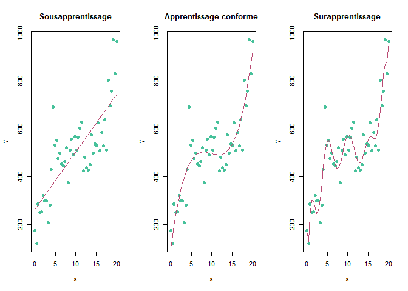<!-- -->

Afin d’éviter les cas de *mésapprentissage* on peut avoir recours à la
validation croisée.

### Validation croisée

Souvent confondue avec le fait de séparer le tableau en phases
d’entraînement et de test, la validation croisée est un principe
incluant plusieurs algorithmes qui consiste à **entraîner** le modèle
sur un échantillonnage aléatoire des données d’entraînement.

La technique la plus utilisée est le *k-fold*, où l’on sépare
aléatoirement le tableau d’entraînement en un nombre \(k\) de tableaux.
À chaque étape de la validation croisée, on calibre le modèle sur tous
les tableaux sauf un, puis on valide le modèle sur le tableau exclu. La
performance du modèle en entraînement est jugée sur les validations.

### Choix de l’algorithme d’apprentissage

Face aux centaines d’algoritmhes d’apprentissages qui vous sont
offertes, choisir l’algorithme ou les algorithmes adéquats pour vos
données n’est pas facile. Ce choix sera motivé par les tenants et
aboutissants des algorithmes, votre expérience, l’expérience de la
littérature, l’expérience de vos collègues. Une approche raisonnable
est de tester plusieurs modèles et d’approfondir si ce n’est déjà fait
la mathématique des options retenues. Il existe des algorithmes
génétiques, qui ne sont pas couverts ici, permettent de sélectionner
des modèles d’autoapprentissages optimaux. Un de ces algorithmes est
offert par le module Python
[`tpot`](https://epistasislab.github.io/tpot/).

### Déploiement

RData, Shiny

En résumé,

1.  Explorer les données
2.  Sélectionner des algorithmes
3.  Effectuer un prétraitement
4.  Créer un ensemble d’entraînement et un ensemble de test
5.  Lisser les données sur les données d’entraînement avec validation
    croisée
6.  Tester le modèle
7.  Déployer le modèle

## Algorithmes

Il existe des centaines d’algorithmes d’apprentissage. Je n’en couvrirai
que quatre, qui me semblent être appropriés pour la modélisation
phénoménologique des systèmes vivants, et utilisables pour la
régression et la classification.

  - Les k plus proches voisins
  - Les arbres de décision
  - Les réseaux neuronaux
  - Les processus gaussiens

## L’autoapprentissage en R

Plusieurs options sont disponibles.

1.  Les modules que l’on retrouve en R pour l’autoapprentissage sont
    nombreux, et parfois spécialisés. Il est possible de les utiliser
    individuellement.
2.  Chacun de ces modules fonctionne à sa façon. Le module `caret` de R
    a été conçu pour donner accès à des centaines de fonctions
    d’autoapprentissage via une interface commune.
3.  Le module `mlr` occupe sensiblement le même créneau que `caret`,
    mais utilise plutôt une approche par objets connectés. Au moment
    d’écrire ces lignes, `mlr` est peu documenté, donc *a priori*
    plus complexe à prendre en main.
4.  En Python, le module `scikit-learn` offre un interface unique pour
    l’utilisation de nombreuses techniques d’autoapprentissage. Il est
    possible d’appeler des fonctions de Python à partir de R grâce au
    module `reticulate`.

Dans ce chapitre, nous verrons comment fonctionnent certains algorithmes
sélectionnés, puis nous les appliquerons avec le module respectif qui
m’a semblé le plus approprié. Vous remarquerez néanmoins des
références récurentes aux modules de Python. En ce moment, la force de
R réside dans la gestion des tableaux, les tests statistiques,
l’exploration heuristique et la visualisation de données. Néanmoins,
Python le surpasse pour
    l’autoapprentissage…

``` r
library("tidyverse") # évidemment
```

    ## ── Attaching packages ──────────────────────────────────────────────────────────────────────────── tidyverse 1.2.1 ──

    ## ✔ ggplot2 3.1.0     ✔ purrr   0.2.5
    ## ✔ tibble  1.4.2     ✔ dplyr   0.7.7
    ## ✔ tidyr   0.8.2     ✔ stringr 1.3.1
    ## ✔ readr   1.1.1     ✔ forcats 0.3.0

    ## ── Conflicts ─────────────────────────────────────────────────────────────────────────────── tidyverse_conflicts() ──
    ## ✖ dplyr::filter() masks stats::filter()
    ## ✖ dplyr::lag()    masks stats::lag()

``` r
library("caret")
```

    ## Loading required package: lattice

    ## 
    ## Attaching package: 'caret'

    ## The following object is masked from 'package:purrr':
    ## 
    ##     lift

## Les *k* plus proches voisins

> [](https://youtu.be/-RpYi_Vuviw?t=6m40s)

> “Le… l’idée en arrière pour être… euh… simpliste, là c’est que c’est
> un peu de… euhmm… de la vitamine de vinyle.” - Geroges (Les voisins,
> une pièce de Claude Meunier)

Pour dire comme Georges, le… l’idée en arrière des KNN pour être… euh…
*simpliste*, c’est que un objet va ressembler à ce qui se trouve dans
son voisinage. Les KNN se basent en effet sur une métrique de distance
pour rechercher un nombre \(k\) de points situés à proximité de la
mesure. Les \(k\) points les plus proches sont retenus, \(k\) étant un
entier non nul à optimiser. Un autre paramètre parfois utilisé est la
distance maximale des voisins à considérer: un voisin trop éloigné
pourra être discarté. La réponse attribuée à la mesure est calculée à
partir de la réponse des \(k\) voisins retenus. Dans le cas d’une
régression, on utiliser généralement la moyenne. Dans le cas de la
classification, la mesure prendra la catégorie qui sera la plus présente
chez les \(k\) plus proches voisins.

L’algorithme des *k* plus proches voisins est relativement simple à
comprendre. Certains pièges sont, de même, peuvent être contournés
facilement. Imaginez que vous rechercher les points les plus rapprochés
dans un système de coordonnées géographiques où les coordonnées \(x\)
sont exprimées en mètres et les coodonnées \(y\), en centimètres. Vous y
projetez trois points.

``` r
data <- data.frame(X = c(0, 1, 0),
                   Y = c(0, 0, 1),
                   row.names = c('A', 'B', 'C'))
options(repr.plot.width = 4, repr.plot.height = 4)
par(pty="s")
plot(data, cex=3,
     xlab = 'Position X (m)', ylab = 'Position Y (cm)')
text(data, labels = rownames(data))
```

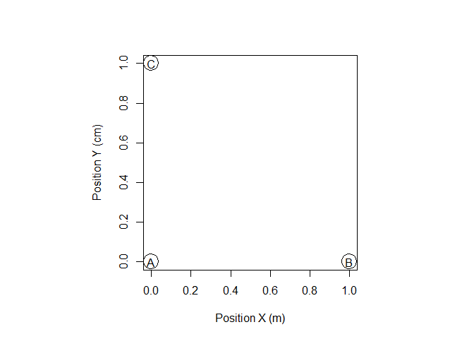<!-- -->

Techniquement la distance A-B est 100 plus élevée que la distance A-C,
mais l’algorithme ne se soucie pas de la métrique que vous utilisez. Il
est promordial dans ce cas d’utiliser la même métrique. Cette stratégie
est évidente lorsque les variables sont comparables. C’est rarement le
cas, que ce soit lorsque l’on compare des dimensions physionomiques (la
longueur d’une phalange ou celle d’un fémur) mais lorsque les variables
incluent des mélanges de longueurs, des pH, des décomptes, etc., il est
important de bien identifier la métrique et le type de distance qu’il
convient le mieux d’utiliser. En outre, la standardisation des données à
une moyenne de zéro et àun écart-type de 1 est une approche courrament
utilisée.

### Exemple d’application

Pour ce premier exemple, je présenterai un cheminement
d’autoapprentissage, du prétraitement au test.

``` r
# ionome
```

## Les arbres décisionnels


Un arbre décisionnel est une collection hiérarchisée de décisions, le
plus souvent binaires. Chaque embranchement est un test à vrai ou faux
sur une variable. La réponse, que ce soit une catégorie ou une valeur
numérique, se trouve au bout de la dernière branche. Les suites de
décisions sont organisées de manière à ce que la précision de la
réponse soit optimisée.

Par exemple, …

# Les réseaux neuronaux

Après les KNN et les random forests, nous passons au domaine plus
complexe des réseaux neuronnaux. Il en existe plusieurs formes, dont la
plus simple manifestation est le *perceptron multicouche*. Le terme
*réseau neuronal* est une métaphore liée à une perception que l’on
avait du fonctionnement du cerveau humain lorsque la technique des
réseaux neuronnaux a été développée dans les années 1950. Un réseau
neuronnal comprend une série de boîtes d’entrées liée à des fonctions
qui transforment et acheminent successivement l’information jusqu’à la
sortie d’une ou plusieurs réponse. Dans l’exemple suivant, on retrouve 4
variables d’entrée et trois variables de sortie entre lesquelles on
retrouve 5 couches dont le nombre de neuronnes varient entre 3 et 6.


Source: [Neural designer](https://www.neuraldesigner.com/)

Entre la première couche de neuronnes (les variables prédictives) et la
dernière couche (les variables réponse), on retrouve des *couches
cachées*. Chaque neuronne est relié à tous les neuronnes de la couche
suivante.

Les liens sont des poids, qui peuvent prendre des valeurs dans
l’ensemble des nombres réels. À chaque neuronne suivant la première
couche, on fait la somme des poids multipliés par la sortie du neuronne.
Le nombre obtenu entre dans chaque neuronne de la couche. Le neuronne
est une fonction, souvent très simple, qui transforme le nombre. La
fonction plus utilisée est probablement la fonction ReLU, pour
*rectified linear unit*, qui expulse le même nombre aux neuronnes de la
prochaine couche s’il est positif: sinon, il expulse un zéro.

**Exercice**. Si tous les neuronnes sont des fonctions ReLU, calculez la
sortie de ce petit réseau neuronal.


Vous trouverez la réponse sur l’image `images/11_nn_ex1_R.jpg`.

Il est aussi possible d’ajouter un *biais* à chaque neuronne, qui est un
nombre réel additionné à la somme des neuronnes pondérée par les poids.

L’optimisation les poids pour chaque lien et les biais pour chaque
neuronne (grâce à des algorithmes dont le fonctionnement sort du cadre
de ce cours) constitue le processus d’apprentissage. Avec l’aide de
logiciels et de modules spécialisés, la construction de réseaux de
centaines de neuronnes organisés en centaines de couches vous permettra
de capter des patrons complexes dans des ensembles de données.

Vous avez peut-être déjà entendu parler d’apprentissage profond (ou
*deep learning*). Il s’agit simplement d’une appellation des réseaux
neuronnaux modernisé pour insister sur la présence de plusieurs couches
de neuronnes. C’est un terme à la mode.

### Les réseaux neuronnaux sur R avec Keras

Plusieurs modules sont disponibles sur R pour l’apprentissage profond.
Certains utilisent le module [H2O.ia](https://github.com/h2oai/h2o-3),
propulsé en Java, d’autres utilisent plutôt
[Keras](https://keras.rstudio.com/), propulsé en Python par
l’intermédiaire de tensorflow. J’ai une préférence pour Keras,
puisqu’il supporte les réseaux neuronnaux classiques (perceptrons
multicouche) autant que circonvutionnels ou récurents. Keras pourrait
néanmoins être difficile à installer sur Windows, où Python ne vient
pas par défaut. Sur Windows, Keras ne focntionne qu’avec Anaconda: vous
devez donc installez [Anaconda ou
Miniconda](https://www.anaconda.com/download/#windows) (Miniconda offre
une installation minimaliste).

Pour installer Keras, il suffit d’installer le module (avec devtools
pour obtenir la version la plus récente, i.e.
`devtools::install_github("rstudio/keras")`), puis de lancer la fonction
`install_keras()`. Dans mon cas, j’utilise conda.

``` r
library("keras")
#install_keras(method = "conda")
```

La fonction `install_keras()` installera keras dans un environnement
virtuel nommé `r-tensorflow`. Si vous utilisez conda, vous y accéderez
avec cette commande.

``` r
use_condaenv("r-tensorflow")
```

Chargeons les
données.

``` r
abalone <- read_csv("http://archive.ics.uci.edu/ml/machine-learning-databases/abalone/abalone.data",
                    col_names = c('sex', 'length', 'diameter', 'height', 'whole.weight', 'shucked.weight', 'viscera.weight', 'shell.weight', 'rings'))
```

    ## Parsed with column specification:
    ## cols(
    ##   sex = col_character(),
    ##   length = col_double(),
    ##   diameter = col_double(),
    ##   height = col_double(),
    ##   whole.weight = col_double(),
    ##   shucked.weight = col_double(),
    ##   viscera.weight = col_double(),
    ##   shell.weight = col_double(),
    ##   rings = col_integer()
    ## )

``` r
set.seed(84668)
abal_tr_index <- createDataPartition(abalone$sex, p = 0.75, list = FALSE)

x <- abalone %>% select(-sex) %>% as.matrix()
x_tr <- x[abal_tr_index, ]
x_te <- x[-abal_tr_index, ]

y_num <- as.numeric(as.factor(abalone$sex)) - 1
y <- to_categorical(y_num)
y_tr <- y[abal_tr_index, ]
y_te <- y[-abal_tr_index, ]

keras_model <- keras_model_sequential() 
keras_model %>% 
  layer_dense(units = 256, activation = 'relu', input_shape = ncol(x)) %>% 
  layer_dropout(rate = 0.2) %>% 
  layer_dense(units = 256 * 2, activation = 'relu', input_shape = ncol(x)) %>% 
  layer_dropout(rate = 0.2) %>% 
  layer_dense(units = 256 * 4, activation = 'relu', input_shape = ncol(x)) %>% 
  layer_dropout(rate = 0.2) %>% 
  layer_dense(units = 256 * 4, activation = 'relu', input_shape = ncol(x)) %>% 
  layer_dropout(rate = 0.2) %>% 
  layer_dense(units = 256 * 2, activation = 'relu', input_shape = ncol(x)) %>% 
  layer_dropout(rate = 0.2) %>% 
  layer_dense(units = 256, activation = 'relu', input_shape = ncol(x)) %>% 
  layer_dropout(rate = 0.2) %>% 
  layer_dense(units = 128, activation = 'relu') %>%
  layer_dense(units = 3, activation = 'softmax')

keras_model %>% compile(
  loss = 'categorical_crossentropy',
  optimizer = optimizer_rmsprop(),
  metrics = c('accuracy')
)

history <- keras_model %>% fit(
  x_tr, y_tr, 
  epochs = 15, batch_size = 128, 
  validation_split = 0.25
)

plot(history)
```

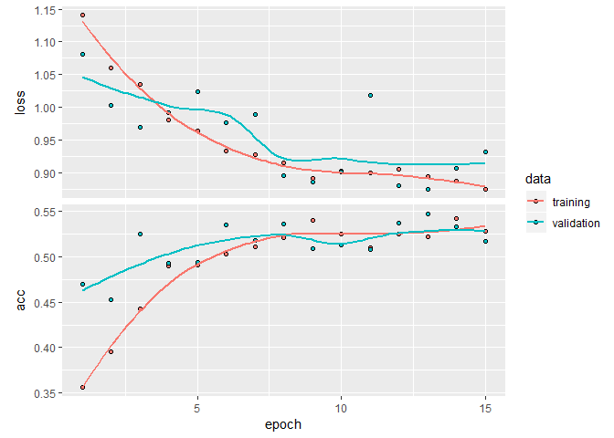<!-- -->

``` r
keras_model %>% evaluate(x_te, y_te)
```

    ## $loss
    ## [1] 0.9378041
    ## 
    ## $acc
    ## [1] 0.5196548

``` r
pred_te <- keras_model %>% predict_classes(x_te)
pred_te[pred_te == 0] <- 'F'
pred_te[pred_te == 1] <- 'I'
pred_te[pred_te == 2] <- 'M'
pred_te <- factor(pred_te, levels = c("F", "I", "M"))

confusionMatrix(factor(abalone$sex[-abal_tr_index]),
                pred_te)
```

    ## Confusion Matrix and Statistics
    ## 
    ##           Reference
    ## Prediction   F   I   M
    ##          F   0  24 302
    ##          I   0 211 124
    ##          M   0  51 331
    ## 
    ## Overall Statistics
    ##                                           
    ##                Accuracy : 0.5197          
    ##                  95% CI : (0.4888, 0.5504)
    ##     No Information Rate : 0.7258          
    ##     P-Value [Acc > NIR] : 1               
    ##                                           
    ##                   Kappa : 0.2566          
    ##  Mcnemar's Test P-Value : <2e-16          
    ## 
    ## Statistics by Class:
    ## 
    ##                      Class: F Class: I Class: M
    ## Sensitivity                NA   0.7378   0.4373
    ## Specificity            0.6874   0.8362   0.8217
    ## Pos Pred Value             NA   0.6299   0.8665
    ## Neg Pred Value             NA   0.8941   0.3555
    ## Prevalence             0.0000   0.2742   0.7258
    ## Detection Rate         0.0000   0.2023   0.3174
    ## Detection Prevalence   0.3126   0.3212   0.3663
    ## Balanced Accuracy          NA   0.7870   0.6295

### Pour aller plus loin

En une heure divisée en [4
vidéos](https://www.youtube.com/playlist?list=PLZHQObOWTQDNU6R1_67000Dx_ZCJB-3pi),
Grant Sanderson explique les réseaux neuronaux de mainère intuitive. En
ce qui a trait à Keras, je recommande le livre [Deep learning with R, de
François
Allaire](https://www.safaribooksonline.com/library/view/deep-learning-with/9781617295546/?ar),
auquel vous avez accès avec un IDUL de l’Université Laval. Si vous vous
sentez à l’aise à utiliser Keras avec le langage Python, je vous
recommande le cours gratuit en ligne [*Applications of deep neural
networks*, de Jeff
Heaton](https://www.youtube.com/watch?v=sRy26qWejOI&list=PLjy4p-07OYzulelvJ5KVaT2pDlxivl_BN).

Des types de réseaux neuronnaux spécialisés ont été développés. Je les
présente sans aller dans les détails.

  - **Réseaux neuronnaux convolutif**. Ce type de réseau neuronal est
    surtout utilisé en reconnaissance d’image. Les couches de neurones
    convolutifs possèdent, en plus des fonctions des perceptrons
    classiques, des filtres permettant d’intégrer les variables
    descriptives connexes à l’observation: dans le cas d’une image, il
    s’agit de scanner les pixels au pourtour du pixel traité. [Une
    brève introduction sur
    Youtube](https://www.youtube.com/watch?v=YRhxdVk_sIs).
  - **Réseaux neuronnaux récurents**. Prédire des occurences futures à
    partir de séries temporelles implique que la réponse au temps t
    dépend non seulement de conditions externes, mais aussi le la
    réponse au temps t-1. Les réseaux neuronnaux récurents. Vous devrez
    ajouter des neuronnes particuliers pour cette tâche, qui pourra être
    pris en charge par Keras grâce aux couches de type [*Long Short-Term
    Memory network*, ou
    LSTM](https://www.youtube.com/watch?v=UnclHXZszpw).
  - **Réseaux neuronnaux probabilistes**. Les réseaux neuronnaux
    non-probabilistes offre une estimation de la variable réponse. Mais
    quelle est la crédibilité de la réponse selon les variables
    descriptives? Question qui pourrait se révéler crutiale en médecine
    ou en ingénierie, à la laquelle on pourra répondre en mode
    probabiliste. Pour ce faire, on pose des distributions *a priori*
    sur les poids du réseau neuronal. Le module
    [`edward`](http://edwardlib.org/), programmé et distribué en Python,
    offre cette possibilité. Vous pourrez accéder à `edward` grâce au
    module `reticulate`, mais à ce stade mieux vaudra basculer en
    Python. Pour en savoir davantage, considérez [cette conférence de
    Andrew Rowan](https://www.youtube.com/watch?v=I09QVNrUS3Q).

# Les processus gaussiens

Les sorties des techniques que sont les KNN, les arbres ou les forêts
ainsi que les réseaux neuronaux sont (classiquement) des nombres réels
ou des catégories. Dans les cas où la crédibilité de la réponse est
importante, il devient pertinent que la sortie soit probabiliste: les
prédictions seront alors présentées sous forme de distributions de
probabilité. Dans le cas d’une classification, la sortie du modèle sera
un vecteur de probabilité qu’une observation appartienne à une classe ou
à une autre. Dans celui d’une régression, on obtiendra une distribution
continue.

Les **processus gaussiens** tirent profit des statistiques bayésiennes
pour effectuer des prédictions probabilistes. D’autres techniques
peuvent être utilisées pour effectuer des prédictions probabilistes,
comme les [réseaux neuronaux
probabilistes](http://edwardlib.org/iclr2017), que j’ai intruduits
précédemment.

Bien que les processus gaussiens peuvent être utilisés pour la
classification, son fonctionnement s’explique favorablement, de manière
intuitive, pas la régression.

## Un approche intuitive

Ayant acquis de l’expérience en enseignement des processus gaussiens,
[John Cunningham](http://stat.columbia.edu/~cunningham/) a développé une
approche intuitive permettant de saisir les mécanismes des processus
gaussiens. lors de conférences disponible sur YouTube
([1](https://youtu.be/BS4Wd5rwNwE),
[2](https://www.youtube.com/watch?v=Jv25sg-IYHU)), il aborde le sujet
par la nécessité d’effectuer une régression non-linéaire.

Générons d’abord une variable prédictive `x`, l’heure, et une variable
réponse `y`, le rythme cardiaque d’un individu en battements par minute
(bpm).

``` r
x <- c(7, 8, 10, 14, 17)
y <- c(61, 74, 69, 67, 78)

plot(x, y, xlab="Heure", ylab="Rythme cardiaque (bpm)")
abline(v=12, lty=3, col='gray50');text(12, 67, '?', cex=2)
abline(v=16, lty=3, col='gray50');text(16, 72, '?', cex=2)
```

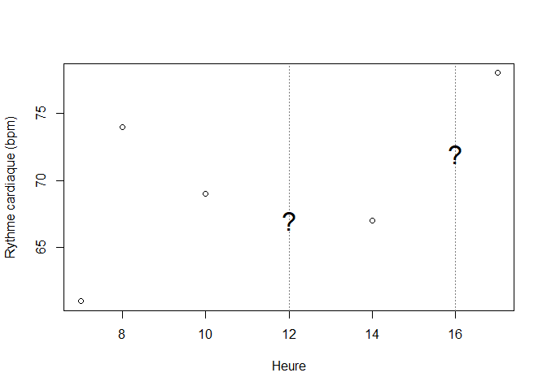<!-- -->

Poser un problème par un processus gaussien, c’est se demander les
valeurs crédibles qui pourraient être obtenues hors du domaine
d’observations (par exemple, dans la figure ci-dessus, à `x=12` et
`x=16`)? Ou bien, de manière plus générale, *quelles fonctions ont pu
générer les variables réponse à partir d’une structure dans les
variables prédictrices?*

Les distributions normales, que nous appellerons *gaussiennes* dans
cette section par concordance avec le terme *processus gaussien*, sont
particulièrement utiles pour répondre à cette question.

Nous avons vu précédemment ce que sont les distributions de probabilité:
des outils mathématiques permettant d’appréhender la structure des
processus aléatoires. Une distribution gaussienne représente une
situation où l’on tire au hasard des valeurs continues. Une distribution
gaussienne de la variable aléatoire \(X\) de moyenne \(0\) et de
variance de \(1\) est notée ainsi:

\[ X \sim \mathcal{N} \left( 0, 1\right)\]

Par exemple, une courbe de distribution gaussienne du rythme cardiaque à
7:00 pourrait prendre la forme suivante.

\[ bpm \sim \mathcal{N} \left( 65, 5\right)\]

En `R`:

``` r
x_sequence <- seq(50, 80, length=100)
plot(x_sequence,
     dnorm(x_sequence, mean=65, sd=5),
     type="l",
     xlab="Rythme cardiaque (bpm)",
     ylab="Densité")
```

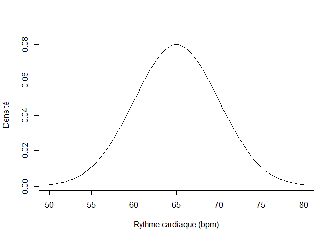<!-- -->

Une distribution **bi**normale, un cas particulier de la distribution
**multi**normale, comprendra deux vecteurs, \(x_1\) et \(x_2\). Elle
aura donc deux moyennes. Puisqu’il s’agit d’une distribution biormale,
et non pas deux distributions normales, les deux variables ne sont pas
indépendantes et l’on utilisera une matrice de coraviance au lieu de
deux variances indépendantes.

\[
\binom{x_1}{x_2} \sim \mathcal{N}
\Bigg( 
\binom{\mu_1}{\mu_2},
\left[ {\begin{array}{cc}
\Sigma_{x_1} & \Sigma_{x_1,x_2} \\
\Sigma_{x_1,x_2}^T & \Sigma_{x_2} \\
\end{array} } \right]
\Bigg)
\]

La matrice \(\Sigma\), dite de *variance-covariance*, indique sur sa
diagonale les variances des variables (\(\Sigma_{x_1}\) et
\(\Sigma_{x_2}\)). Les covariances \(\Sigma_{x_1,x_2}\) et
\(\Sigma_{x_1,x_2}^T\) sont symétriques et indiquent le lien entre les
variables.

On pourrait supposer que le rythme cardiaque à 8:00 soit corrélé avec
celui à 7:00. Mises ensembles, les distriutions gaussiennes à 7:00 et à
8:00 formeraient une distribution gaussienne binormale.

\[
\binom{bpm_7}{bpm_8} \sim \mathcal{N}
\Bigg( 
\binom{65}{75},
\left[ {\begin{array}{cc}
10 & 6 \\
6 & 15 \\
\end{array} } \right]
\Bigg)
\]

En `R`:

``` r
library("ellipse")
```

    ## 
    ## Attaching package: 'ellipse'

    ## The following object is masked from 'package:graphics':
    ## 
    ##     pairs

``` r
means_vec <- c(65, 75)
covariance_mat <- matrix(c(10, 6, 6, 15), ncol=2)
par(pty='s')
plot(ellipse(x=covariance_mat, centre=means_vec, levels=0.95), 
     type='l',
     xlab="Rythme cardiaque à 7:00 (bpm)",
     ylab="Rythme cardiaque à 8:00 (bpm)")
```

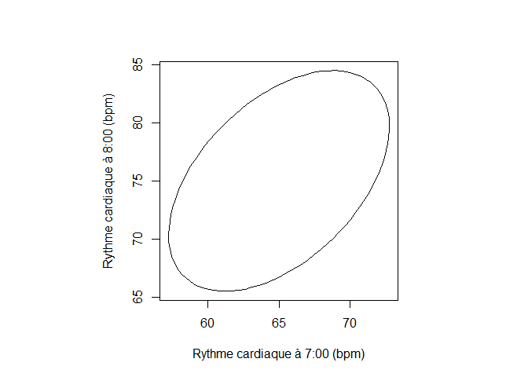<!-- -->

``` r
#lines(ellipse(x=covariance_mat, centre=means_vec, level=0.8))
```

On peut se poser la question: étant donnée que \(x_1 = 68\), quelle
serait la distribution de \(x_2\)? Dans ce cas bivariée, la distribution
marginale serait univariée, mais dans le cas multivarié en \(D\)
dimensions, la distribution marginale où l’on spécifie \(m\) variables
serait de \(D-m\). de Une propriété fondamentale d’une distribution
gaussienne est que peu importe l’endroit où l’angle selon lequel on la
tranche, la distribution marginale sera aussi gaussienne. Lorsque l’on
retranche une ou plusieurs variables en spécifiant la valeur qu’elles
prennent, on applique un *conditionnement* à la distribution.

``` r
library("condMVNorm")
```

    ## Loading required package: mvtnorm

``` r
condition_x1 <- 61 # changer ce chiffre pour visualiser l'effet

cond_parameters <- condMVN(mean=means_vec, sigma=covariance_mat,
                           dependent=2, given=1, X.given=condition_x1)
cond_mean <- cond_parameters$condMean
cond_sd <- sqrt(cond_parameters$condVar)
x2_sequence <- seq(50, 90, length=100)
x2_dens <- dnorm(x2_sequence, mean=cond_mean, sd=cond_sd)

par(pty='s')
plot(ellipse(x=covariance_mat, centre=means_vec, levels=0.95), type='l',
     xlab="Rythme cardiaque à 7:00 (bpm)",
     ylab="Rythme cardiaque à 8:00 (bpm)")
abline(v=condition_x1, col='#f8ad00', lwd=2, lty=2)
lines(x=condition_x1 + x2_dens*40, y=x2_sequence, col="#f8ad00", lwd=2)
lines(x = c(condition_x1, condition_x1),
      y = c(cond_mean-cond_sd, cond_mean+cond_sd),
      lwd=3, col='#00aaf2')
points(condition_x1, cond_mean, 
       col='#00aaf2', pch=16, cex=2)

n_sample <- 20
points(x = rep(condition_x1, n_sample),
       y = rnorm(n_sample, cond_mean, cond_sd),
       pch=4)
```

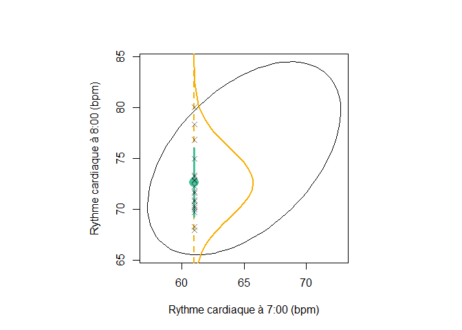<!-- -->

Les points sur l’axe (symbole x) conditionnés sont des échantillons
tirés au hasard dans la distribution conditionnée.

Une autre manière de visualiser la distribution gausienne binormale est
de placer \(x_1\) et \(x_2\) côte à côte en abcisse, avec leur valeur en
ordonnée. Le bloc de code suivant peut sembler lourd au premier coup
d’oeil: pas de panique, il s’agit surtout d’instructions graphiques.
Vous pouvez vous amuser à changer les paramètres de la distribution
binormale (section 1) ainsi que la valeur de \(x_1\) à laquelle est
conditionnée la distribution de \(x_2\) (section 2).

``` r
source("lib/plot_matrix.R")

# 1. Distribution
means_vec <- c(65, 65)
covariance_mat <- matrix(c(10, 6, 6, 15), ncol=2)

# 2. Condition
condition_x1 <- 61 # changer ce chiffre pour visualiser l'effet

# 3. Densité conditionnée
cond_parameters <- condMVN(mean=means_vec, sigma=covariance_mat,
                           dependent=2, given=1, X.given=condition_x1)
cond_mean <- cond_parameters$condMean
cond_sd <- sqrt(cond_parameters$condVar)
x2_sequence <- seq(50, 90, length=100)
x2_dens <- dnorm(x2_sequence, mean=cond_mean, sd=cond_sd)
x2_draw <- rnorm(1, cond_mean, cond_sd)

# 4. Graphiques
options(repr.plot.width = 8, repr.plot.height = 5)
layout(matrix(c(1,2,3,3), nrow=2), widths=c(1,2))
par(mar=c(4, 4, 1, 1), pty='s')

## 4.1 Ellipse
plot(ellipse(x=covariance_mat, centre=means_vec, levels=0.95), 
     type='l', xlab="BPM à 7:00", ylab="BPM à 8:00")
abline(v=condition_x1, col='#f8ad00', lwd=1)
lines(x=condition_x1 + x2_dens*40, y=x2_sequence, col="#f8ad00", lwd=1)
lines(x = c(condition_x1, condition_x1),
      y = c(cond_mean-cond_sd, cond_mean+cond_sd),
      lwd=2, col='#00aaf2')
points(condition_x1, cond_mean, 
       col='#00aaf2', pch=16, cex=1)
points(condition_x1, x2_draw, pch=16, col="#ff7998")

## 4.2 Covariance
plot_matrix(covariance_mat)

## 4.3 Série
plot(c(1, 2), c(condition_x1, x2_draw), xlim=c(0, 6), ylim=c(55, 75), type='l',
     xlab="Indice de la variable", ylab="Rythme cardiaque (bmp)")
points(1, condition_x1, pch=16, col='#00aaf2', cex=3)
points(2, x2_draw, pch=16, col='#ff7998', cex=3)
```

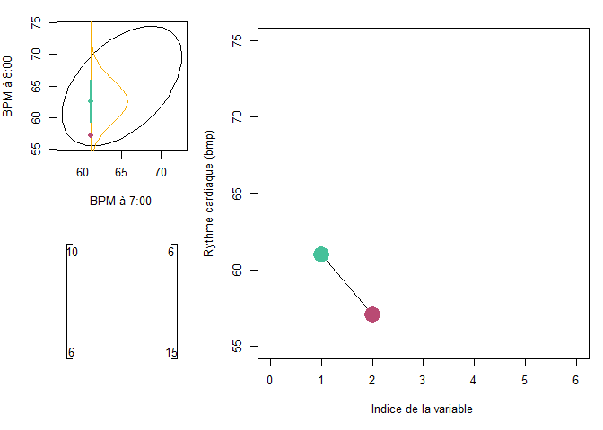<!-- -->

Les valeurs que peuvent prendre le rythme cardiaque en \(x_2\) sont
tirées aléatoirement d’une distribution conditionnée. Sautons
maintenant au cas multinormal, incluant 6 variables (*hexanormal*\!).
Afin d’éviter de composer une matrice de covariance à la mitaine, je me
permets de la générer avec une fonction. Cette fonction particulière est
nommée *fonction de base radiale* ou *exponentiel de la
racine*.

\[K_{RBF} \left( x_i, x_j \right) = \sigma^2 exp \left( -\frac{\left( x_i - x_j \right)^2}{2 l^2}  \right) \]

``` r
RBF_kernel <- function(x, sigma, l) {
  n <- length(x)
  k <- matrix(ncol = n, nrow = n)
  for (i in 1:n) {
    for (j in 1:n) {
      k[i, j] = sigma^2 * exp(-1/(2*l^2) * (x[i] - x[j])^2)
    }
  }
  colnames(k) <- paste0('x', 1:n)
  rownames(k) <- colnames(k)
  return(k)
}
```

Dans la fonction `RBF_kernel`, `x` désigne les dimensions, `sigma`
désigne un écart-type commun à chacune des dimensions et `l` est la
longueur désignant l’amplification de la covariance entre des dimensions
éloignées (dans le sens que la première dimension est éloignée de la
dernière). Pour 6 dimensions, avec un écart-type de 4 et une longueur de
2.

``` r
covariance_6 <- RBF_kernel(1:6, sigma=4, l=2)
round(covariance_6, 2)
```

    ##       x1    x2    x3    x4    x5    x6
    ## x1 16.00 14.12  9.70  5.19  2.17  0.70
    ## x2 14.12 16.00 14.12  9.70  5.19  2.17
    ## x3  9.70 14.12 16.00 14.12  9.70  5.19
    ## x4  5.19  9.70 14.12 16.00 14.12  9.70
    ## x5  2.17  5.19  9.70 14.12 16.00 14.12
    ## x6  0.70  2.17  5.19  9.70 14.12 16.00

Changez la valeur de `l` permet de bien saisir son influence sur la
matrice de covariance. Avec un `l` de 1, la covariance entre \(x_1\) et
\(x_6\) est pratiquement nulle: elle est un peut plus élevée avec `l=2`.
Pour reprendre l’exemple du rythme cardiaque, on devrait en effet
s’attendre à retrouver une plus grande corrélation entre celles
mesurées aux temps 4 et 5 qu’entre les temps 1 et 6.

De même que dans la situation où nous avions une distribution binormale,
nous pouvons conditionner une distribution multinormale. Dans l’exemple
suivant, je conditionne la distribution multinormale de 6 dimensions en
spécifiant les valeurs prises par les deux premières dimensions. Le
résultat du conditionnement est une distribution en 4 dimensions.
Puisqu’il est difficile de présenter une distribution en 6D, le
graphique en haut à gauche ne comprend que les dimensions 1 et 6.
Remarquez que la corrélation entre les dimensions 1 et 6 est faible, en
concordance avec la matrice de covariance générée par la fonction
`RBF_kernel`. Lancez plusieurs fois le code et voyez ce qui advient des
échantillonnages dans les dimensions 3 à 6 selon le conditionnement en
1 et 2.

``` r
library("MASS")
```

    ## 
    ## Attaching package: 'MASS'

    ## The following object is masked from 'package:dplyr':
    ## 
    ##     select

``` r
# 1. Distribution
means_vec <- rep(65, 6)
covariance_mat <- covariance_6

# 2. Condition
conditions_x <- c(61, 74) # changer ces chiffres pour visualiser l'effet

# 3. Densité conditionnée
cond_parameters <- condMVN(mean=means_vec, sigma=covariance_mat, 
                           dependent.ind = 3:6, given.ind=1:2,
                           X.given=conditions_x)
cond_mean <- cond_parameters$condMean
cond_sd <- sqrt(cond_parameters$condVar)
x6_sequence <- seq(50, 90, length=100)
x6_dens <- dnorm(x2_sequence, mean=cond_mean[4], sd=cond_sd[4, 4])

x_3.6_draw <- mvrnorm(n = 1, mu = cond_mean, Sigma = cond_sd^2)

# 4. Graphiques
layout(matrix(c(1,2,3,3), nrow=2), widths=c(1,2))
par(mar=c(4, 4, 1, 1))

## 4.1 Ellipse
plot(ellipse(x=covariance_mat[c(1, 6), c(1, 6)], centre=means_vec[c(1, 6)], levels=0.95), 
     type='l', xlab="BPM à 7:00", ylab="BPM à 8:00")
abline(v=conditions_x[1], col='#f8ad00', lwd=1)
lines(x=condition_x1 + x6_dens*40, y=x2_sequence, col="#f8ad00", lwd=1)
lines(x = c(conditions_x[1], conditions_x[1]),
      y = c(cond_mean[4]-cond_sd[4, 4], cond_mean[4]+cond_sd[4, 4]),
      lwd=2, col='#00aaf2')
points(conditions_x[1], cond_mean[4],
       col='#00aaf2', pch=16, cex=1)
points(conditions_x[1], x_3.6_draw[4], pch=16, col="#ff7998")

## 4.2 Covariance
plot_matrix(covariance_mat, cex=0.8)

## 4.3 Série
plot(1:6, c(conditions_x, x_3.6_draw), xlim=c(0, 6), ylim=c(60, 85), type='l',
     xlab="Indice de la variable", ylab="Rythme cardiaque (bmp)")
points(c(1, 2), conditions_x, pch=16, col='#00aaf2', cex=3)
points(3:6, x_3.6_draw, pch=16, col='#ff7998', cex=3)
```

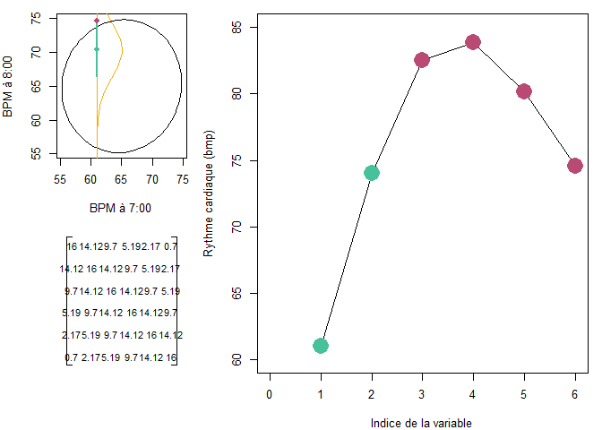<!-- -->

La structure de la covariance assure que les dimensions proches prennent
des valeurs similaires, assurant une courbe lisse et non en dents de
scie. Pourquoi s’arrêter à 6 dimensions? Prenons-en plusieurs, puis
générons plus d’un échantillon.

``` r
# 1. Distribution
n <- 20
means_vec <- rep(65, n)
covariance_mat <- RBF_kernel(x = 1:n, sigma = 10, l = 2)

# 2. Condition
conditions_x <- c(61, 74) # changer ces chiffres pour visualiser l'effet

# 3. Densité conditionnée
cond_parameters <- condMVN(mean=means_vec, sigma=covariance_mat, 
                           dependent.ind = 3:n, given.ind=1:2,
                           X.given=conditions_x)
cond_mean <- cond_parameters$condMean
cond_sd <- cond_parameters$condVar

# 4. Graphiques
par(mar=c(4, 4, 1, 1))

## 4.3 Série
plot(0, 0, xlim=c(0, n), ylim=c(40, 95), type='l',
     xlab="Indice de la variable", ylab="Rythme cardiaque (bmp)")

samples <- 50
x_3.n_draw <- matrix(ncol = samples, nrow = n-2)
for (i in 1:30) {
  x_3.n_draw[, i] <- mvrnorm(n = 1, mu = cond_mean, Sigma = cond_sd)
  lines(1:n, c(conditions_x, x_3.n_draw[, i]), col = rgb(0, 0, 0, 0.2))
}
x_3.n_draw_mean <- apply(x_3.n_draw, 1, mean)

lines(1:n, c(conditions_x, x_3.n_draw_mean), lwd = 2)
points(c(1, 2), conditions_x, pch=16, col='#00aaf2', cex=1)
```

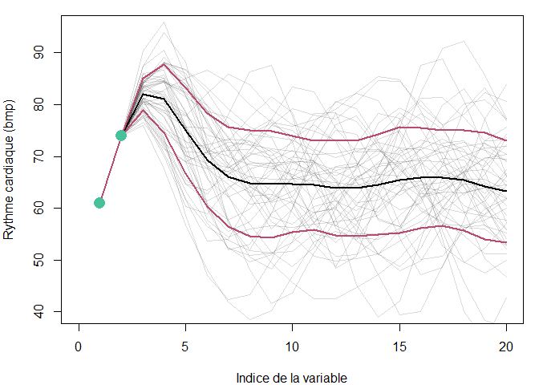<!-- -->

Les simulations permettent de calculer des statistiques pour chacune des
dimensions.

``` r
x_3.n_draw <- mvrnorm(n = 1000, mu = cond_mean, Sigma = cond_sd)
means_draw <- apply(x_3.n_draw, 2, mean)
sd_draw <- apply(x_3.n_draw, 2, sd)

plot(1:n, c(conditions_x, means_draw), xlim=c(0, n), ylim=c(40, 90), type='l',
     xlab="Indice de la variable", ylab="Rythme cardiaque (bmp)")
points(c(1, 2), conditions_x, pch=16, col='#00aaf2', cex=1)
points(3:n, means_draw, pch=16, col='#ff7998', cex=1)
for (i in 1:(n-2)) {
  lines(c(i+2, i+2), c(means_draw[i] - sd_draw[i], 
                       means_draw[i] + sd_draw[i]),
        col = "#ff7998")
}
```

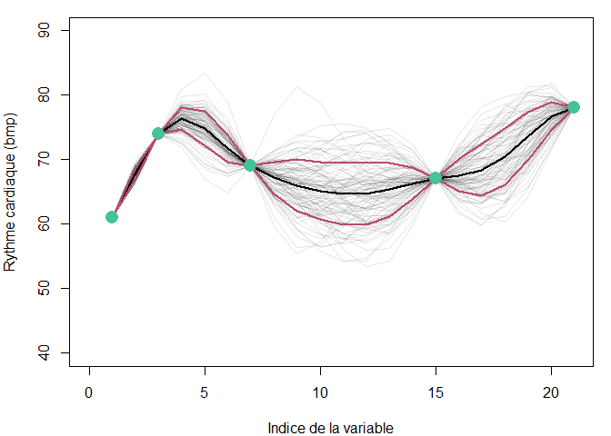<!-- -->

Revenons au rythme cardiaque. On pourra utiliser le conditionnement aux
temps observés, soit 7:00, 8:00, 10:00, 14:00 et 17:00 pour estimer la
distribution à 12:00 et 16:00, où à des dimensions artificielles
quelconques ici fixées aux demi-heures.

``` r
# 1. Distribution
n <- 21
means_vec <- rep(65, n)
covariance_mat <- RBF_kernel(x = 1:n, sigma = 5, l = 2)

# 2. Condition
conditions_x <- c(61, 74, 69, 67, 78)
conditions_indices <- c(1, 3, 7, 15, 21)
dependent_indices <- (1:20)[! 1:20 %in% conditions_indices]

# 3. Densité conditionnée
cond_parameters <- condMVN(mean=means_vec, sigma=covariance_mat, 
                           dependent.ind = dependent_indices,
                           given.ind=conditions_indices,
                           X.given=conditions_x)
cond_mean <- cond_parameters$condMean
cond_sd <- cond_parameters$condVar
x_draw <- mvrnorm(n = 500, mu = cond_mean, Sigma = cond_sd)
means_draw <- apply(x_draw, 2, mean)
sd_draw <- apply(x_draw, 2, sd)

# 4. Graphiques
options(repr.plot.width = 5, repr.plot.height = 4)
par(mar=c(4, 4, 1, 1))

bpm <- rep(NA, n)
bpm[conditions_indices] <- conditions_x
bpm[dependent_indices] <- means_draw


## 4.3 Série
plot(1:n, bpm, xlim=c(0, n), ylim=c(40, 90), type='l',
     xlab="Indice de la variable", ylab="Rythme cardiaque (bmp)")
points(conditions_indices, bpm[conditions_indices], pch=16, col='#00aaf2', cex=1)
points(dependent_indices, bpm[dependent_indices], pch=16, col='#ff7998', cex=1)

for (i in 1:length(sd_draw)) {
  lines(c(dependent_indices[i], dependent_indices[i]),
        c(means_draw[i] - sd_draw[i], 
          means_draw[i] + sd_draw[i]),
        col = "#ff7998")
}
```

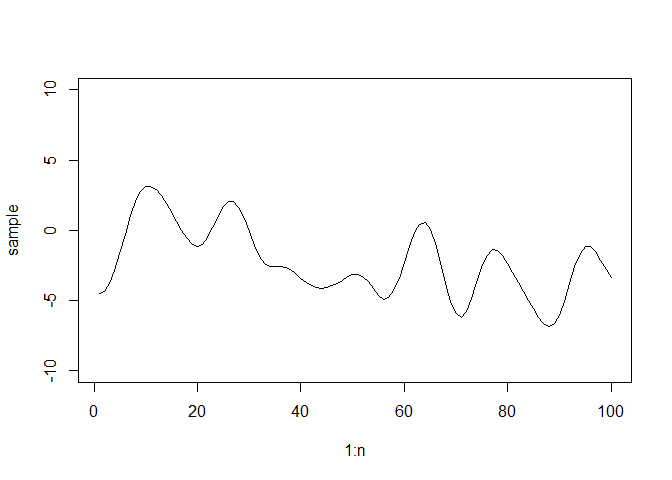<!-- -->

Comme on devrait s’y attendre, la régression résultant de la mise en
indices de la distribution est précise aux mesures, et imprécise aux
indices peu garnies en mesures. Nous avions utilisé 21 dimensions.
**Lorsque l’on généralise la procédure à une quantité infinie de
dimensions, on obtient un *processus gaussien*.**


L’indice de la variable devient ainsi une valeur réelle. Un processus
gaussien, \(\mathcal{GP}\), est défini par une fonction de la moyenne,
\(m \left( x \right)\), et une autre de la covariance que l’on nomme
*noyau* (ou *kernel*), \(K \left( x, x' \right)\). Un processus gaussien
est noté de la manière
suivante:

\[\mathcal{GP} \sim \left( m \left( x \right), K \left( x, x' \right) \right)\]

La fonction définissant la moyenne peut être facilement écartée en
s’assurant de normaliser la variable réponse. Par convention, on
spécifie une fonction de moyenne comme retournant toujours un zéro.
Quant au noyau, il peut prendre différentes formes. De plus ces formes
peuvent être combinées. Règle générale, on utilisera un noyau permettant
de définir deux paramètres: la hauteur (\(\sigma\)) et la longueur de
l’ondulation (\(l\)).

``` r
# Faites varier ces paramètres
SIGMA <- 3
L <- 5

# Graphique
n <- 100
sample <- mvrnorm(n = 1, mu = rep(0, n), 
                  Sigma = RBF_kernel(x=1:n, sigma = SIGMA, l = L))
plot(1:n, sample, type='l', ylim=c(-10, 10))
```

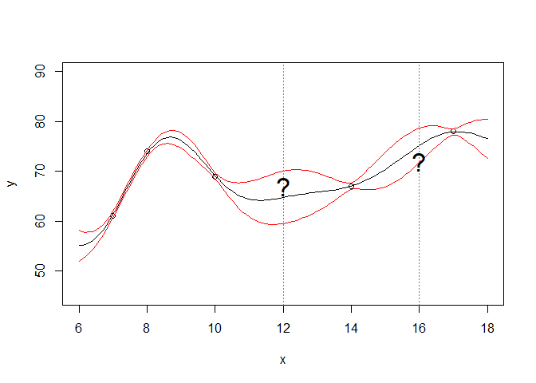<!-- -->

On pourra ajouter à ce noyau un bruit blanc, c’est-à-dire une variation
purement aléatoire, sans covariance (noyau générant une matrice
diagonale).

Le noyau devient ainsi un *a priori*, et le processus gaussien
conditionné aux données devient un *a posteriori* probabiliste.

Finalement, les processus gaussiens peuvent être extrapolés à plusieurs
variables descriptives.

### Les processus gaussiens en `R`

Pas de souci, vous n’aurez pas à programmer vos propres fonctions pour
lancer des processus gaussiens. Vous pourrez [passer par
`caret`](https://topepo.github.io/caret/train-models-by-tag.html#gaussian-process).
Vous pourriez, comme c’est le cas avec les réseaux neuronnaux, obtenir
davantage de contrôle sur l’autoapprentissage en utilisant directement
la fonction `gausspr` du package `kernlab`.

``` r
library(kernlab)
```

    ## 
    ## Attaching package: 'kernlab'

    ## The following object is masked from 'package:purrr':
    ## 
    ##     cross

    ## The following object is masked from 'package:ggplot2':
    ## 
    ##     alpha

``` r
x <- c(7, 8, 10, 14, 17)
y <- c(61, 74, 69, 67, 78)
y_sc <- (y - mean(y)) / sd(y)

m <- gausspr(x, y_sc, kernel = 'rbfdot',
             kpar = list(sigma = 4),
             variance.model = TRUE, scaled = TRUE,
             var = 0.01,
             cross = 2)

xtest <- seq(6, 18, by = 0.1)
y_sc_pred_mean <- predict(m, xtest, type="response")
y_pred_mean <- y_sc_pred_mean * sd(y) + mean(y)
y_sc_pred_sd <- predict(m, xtest, type="sdeviation")
y_pred_sd <- y_sc_pred_sd * sd(y)

plot(x, y, xlim = c(6, 18), ylim = c(45, 90))
lines(xtest, y_pred_mean)
lines(xtest, y_pred_mean + y_pred_sd, col="red")
lines(xtest, y_pred_mean - y_pred_sd, col="red")
abline(v=12, lty=3, col='gray50');text(12, 67, '?', cex=2)
abline(v=16, lty=3, col='gray50');text(16, 72, '?', cex=2)
```

<!-- -->

### Application pratique

Les processus gaussiens sont utiles pour effectuer des prédictions sur
des phénomène sur lesquels on désire éviter de se commettre sur la
structure. Les séries temporelles ou les signaux spectraux en sont des
exemples. Aussi, j’ai utilisé les processus gaussiens pour modéliser des
courbes de réponse aux fertilisants.

EXEMPLE…

Prédiction spatiale: -
<https://www.sciencedirect.com/science/article/pii/S2211675316300033> -
<https://stackoverflow.com/questions/43618633/multi-output-spatial-statistics-with-gaussian-processes>
